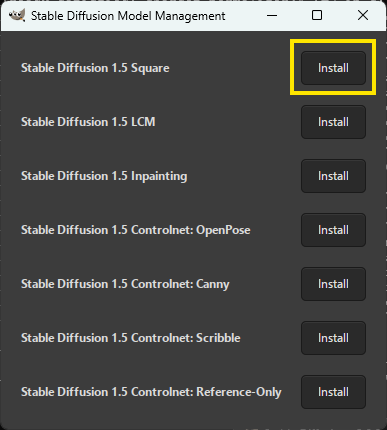
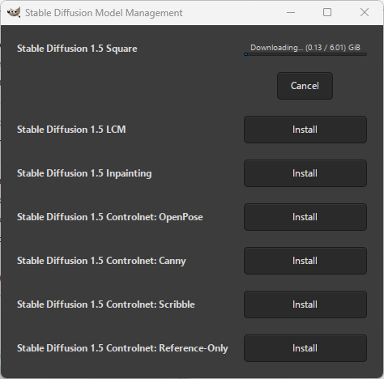
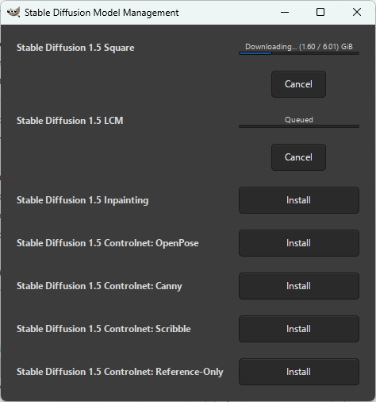
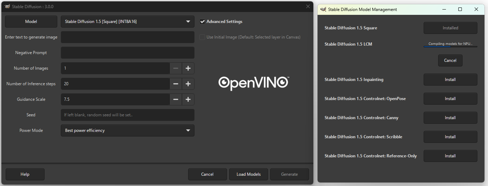
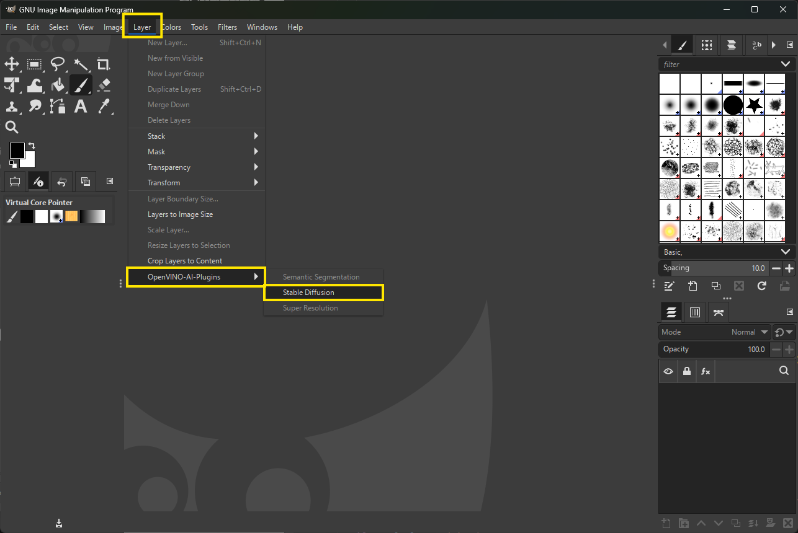

# Using Stable Diffusion in GIMP

After installing GIMP and the GIMP AI plugins with OpenVINO™, you can now start GIMP application from Start Menu on Windows, or from the Application Launcher in Ubuntu. 

>Notes: This section runs `SD-1.5 Square (512x512)` as an example. 

## Download & Install Stable Diffusion Models
- Once GIMP application is started, Click "__Layer__" \> "__OpenVINO-AI-Plugins__" \> "__Stable diffusion__".
- Once Stable Diffusion Plugin UI opens up, click on Model Button on the top left corner as show in the below picture:

    
- This now opens the Stable Diffusion Model Management window from where you can install the required models by clicking on "Install" button next to the model name. 

      

 - Download Stable Diffusion 1.5 Square as an instance. 

    
 
 - You can select multiple models at once, and the Model Manager will queue them for installation.

   
  
 - Once installation process is completed, you will see the "Install" button is updated to "Installed" and you will find the models in the drop-down list

    
    
    >**Notes:**
    > - The downloaded models include INT8, INT8A16, and FP16 precision
    > - Weights is saved at `C:\Users\<user_name>\openvino-ai-plugins-gimp\weights`.

## Execute Stable-Diffusion – Stable Diffusion 1.5 INT8A16

Please follow below steps to execute Stable-Diffusion - Stable Diffusion 1.5 INT8A16. For other features, please refer to [OpenVINO™ Image Generator Plugin with Stable Diffusion](https://github.com/intel/openvino-ai-plugins-gimp/tree/main?tab=readme-ov-file#openvino-image-generator-plugin-with-stable-diffusion) section.

- Following previous section to launch GIMP

    

- Click "__Layer__" \> "__OpenVINO-AI-Plugins__" \> "__Stable diffusion__".

    

- Change the selected fields to set "Stable Diffusion" configuration and choose the desired "Power Mode" you want, then click "Load Models" to the load models into the target devices based on your power mode selection. 

    

    > **Notes:** It takes time in this step. 

- Finally, you can optionally enter any text or changes the parameters in the selected field, then click "Generate" to generate image.

    

    >**Notes:**
    > - Only Intel® devices are supported (CPU, NPU, integraged GPU, Intel® discrete GPUs)
    > - Power Mode is now enabled- Users can select between the following options depending on their use case:
    >   - Best Performance
    >   - Best Power Efficiency
    >   - Balanced
    > - If you wish to generate more images in single run, please modify the Number of Images section.

