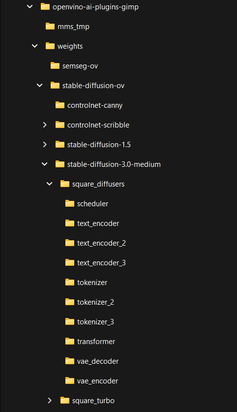
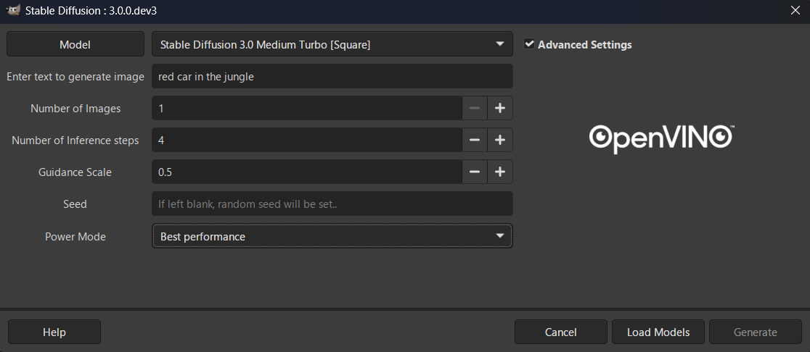

# Image generation with Stable Diffusion 3.0 Medium & Stable Diffusion 3.5 Medium Turbo

## Stable Diffusion 3.0 Medium

Stable Diffusion 3 Medium is a Multimodal Diffusion Transformer (MMDiT) text-to-image model that features greatly improved performance in image quality, typography, complex prompt understanding, and resource-efficiency.


More details about model can be found in [model card](https://huggingface.co/stabilityai/stable-diffusion-3-medium-diffusers), [research paper](https://stability.ai/news/stable-diffusion-3-research-paper) and [Stability.AI blog post](https://stability.ai/news/stable-diffusion-3-medium).

## Stable Diffusion 3.5 Turbo

TensorArt Stable Diffusion 3.5 Medium Turbo (SD3.5M Turbo) is a high-performance text-to-image model distilled from StabilityAI's stable-diffusion-3.5-medium. This model emphasizes stability and efficiency, making it suitable for a wide range of art styles and creative expression scenarios.
More details about model can be found in [model card](https://huggingface.co/tensorart/stable-diffusion-3.5-medium-turbo)


## Enabling SD3 Medium in GIMP
### Converting the Models Using optimum-cli

```
powershell -Command "Invoke-WebRequest -Uri 'https://raw.githubusercontent.com/openvinotoolkit/openvino.genai/refs/heads/master/samples/deployment-requirements.txt' -OutFile deployment-requirements.txt"
powershell -Command "Invoke-WebRequest -Uri 'https://raw.githubusercontent.com/openvinotoolkit/openvino.genai/refs/heads/master/samples/export-requirements.txt' -OutFile export-requirements.txt"
powershell -Command "Invoke-WebRequest -Uri 'https://raw.githubusercontent.com/openvinotoolkit/openvino.genai/refs/heads/master/samples/requirements.txt' -OutFile requirements.txt"
```

Create & activate a python virtual env:
```
python -m venv sd_env
sd_env\Scripts\activate
```
Install pip packages:
```
pip install -r requirements.txt
```

Note: For Stable Diffusion 3, you may need to log into Hugging Face using a token that has access to SD3 gated repo:
```
huggingface-cli login --token <your_hf_token>
```

### Stable Diffusion 3 Medium Diffusers (FP16):

```
optimum-cli export openvino --model stabilityai/stable-diffusion-3-medium-diffusers --task stable-diffusion --weight-format fp16 %userprofile%\openvino-ai-plugins-gimp\weights\stable-diffusion-ov\stable-diffusion-3.0-medium\square_diffusers
```

### Stable Diffusion 3.5 Medium Turbo (FP16):

```
optimum-cli export openvino --model tensorart/stable-diffusion-3.5-medium-turbo --task stable-diffusion --weight-format fp16 %userprofile%\openvino-ai-plugins-gimp\weights\stable-diffusion-ov\stable-diffusion-3.5-medium\square_turbo
```


### Model Installation

After the above models are created, create a file called  `install_info.json` inside the square_turbo & square_diffusers directory. This will ensure that the GIMP plugin will recognize this as a valid model. It should contain the following text:
```
{
    "hf_repo_id": "none",
    "hf_commit_id": "none"
}
```

Verify that the copied files and directory structure looks as follows:

 

### Running with GIMP
After completing model installation steps, SD3.5 Medium - Diffuser & Turbo will now be available in the Stable Diffusion UI. 
Note that for SD3.5 Medium Turbo - Select Guidance Scale between 0.0 - 1.0, as anything greater than 1.0 will result in a failure. Also, with the Turbo version one can generate valid images in as few as 4 iterations. 
See the screenshot below:



