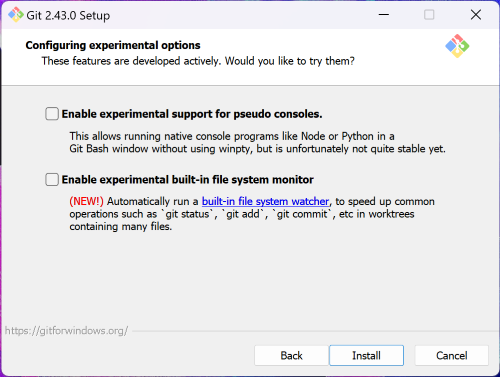
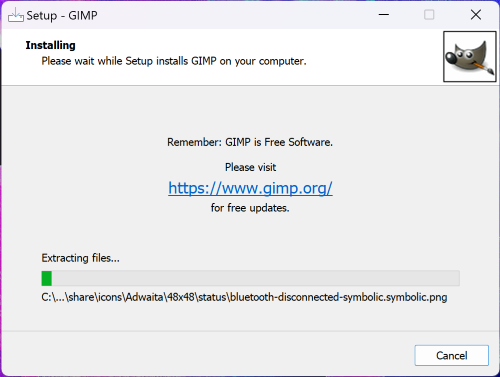

# User guide for Windows Users

## Install GIMP AI plugins with OpenVINO™ 

>__Notes:__ 
>This set of plugins only supports Intel® devices. Non-Intel GPUs and NPUs are not supported. 
>NPU is supported on all Intel® Core™ Ultra series processors. 

### Pre-requisite for execution on Intel® NPU

- Hardware:
  - Intel® Core™ Ultra platform
  - 16GB system memory as minimum requirement
  - internet connection is required for installation
- Driver:
  - Intel® NPU driver: Use the most recent driver you have available. 
- Software and Package:
  - git
  - python 3.9-3.12
    - Note: This document will use python 3.9.13 as an example.
  - VC runtime
  - [GIMP 3.0.2](https://download.gimp.org/gimp/v3.0/windows/gimp-3.0.2-setup-1.exe)
  - [GIMP AI plugins with OpenVINO™ Backend](https://github.com/intel/openvino-ai-plugins-gimp) from Github.


### Install Python

>__Notes:__ Use Python `3.9.13` as an example.

Please download the prebuilt Windows x64 package from [link](https://www.python.org/ftp/python/3.9.13/python-3.9.13-amd64.exe). After downloading, please following below steps to install the Python package.

- Check "Add Python 3.9 to PATH", then click "Install Now"

    
    


- Click "Close"

    


### Install Git

>__Notes:__ Use Git `2.43.0` as an example.

Please download the prebuilt Windows x64 package from [link](https://github.com/git-for-windows/git/releases/download/v2.43.0.windows.1/Git-2.43.0-64-bit.exe). After downloading, please following below steps to install the Git.

- Click "Next", then click "Install"

     

     

     

-  Check out "View Release Notes", then click "Close"

     


### Install Microsoft Visual C++ Redistributable

Please download the latest Visual C++ Redistributable package from MSFT [site](https://aka.ms/vs/17/release/vc_redist.x64.exe). Then, install this package.

 

 

 


### Install GIMP 3.0.2

Please download [GIMP 3.0.2](https://download.gimp.org/gimp/v3.0/windows/gimp-3.0.2-setup-1.exe) and follow below steps to install GIMP.

- Click "Install for all users (recommended)"

    

- Select English and click "OK"

    

- Click "Continue"

    

- Click "Install"

    
    

- Click "Finish" to complete the installation of GIMP

    


### Install GIMP AI plugins
 - Open command prompt and download the latest release from Github by git with below instruction.

    ```sh
    cd C:\Users\Public\
    mkdir GIMP
    cd GIMP
    git clone https://github.com/intel/openvino-ai-plugins-gimp.git
    ```
    > __Notes__:
    > This is an example that will create a `GIMP` folder in `C:\Users\Public\`, and then download the package to `C:\Users\Public\GIMP`, you still can define where to place this package by yourself.

 - Use same command prompt that used in previous steps and follow the command below to install it.

    ```sh
    openvino-ai-plugins-gimp\install.bat
    ```

    This step will take time for downloading necessary packages.

- After creating python environment, gimpenv3, and downloaded necessary packages, you can now launch GIMP application. See the [Usage Guide](GIMP_StableDiffusion_Usage.md) for running Stable Diffusion example.