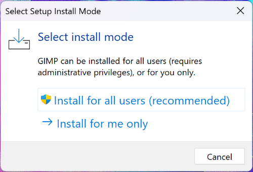
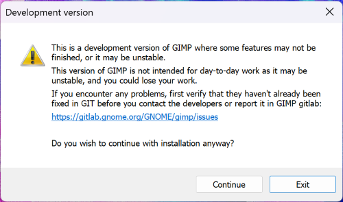
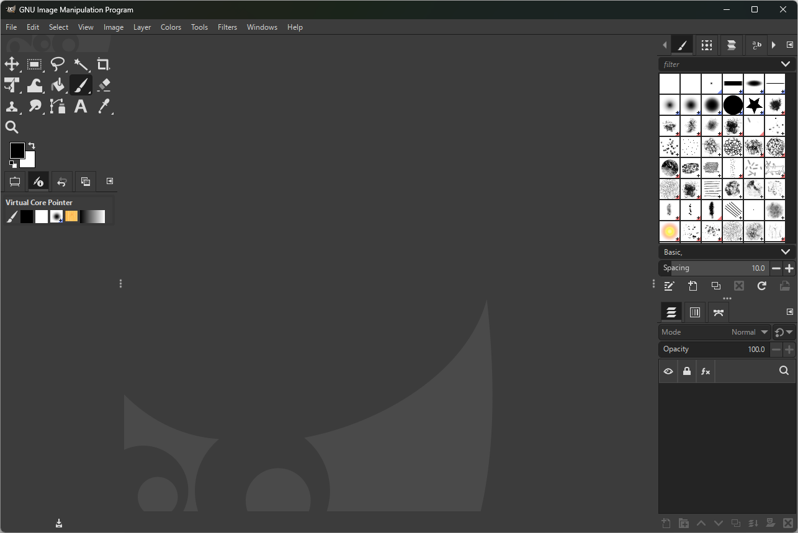
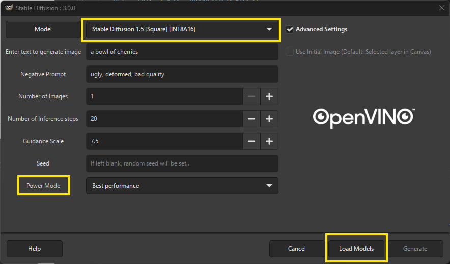
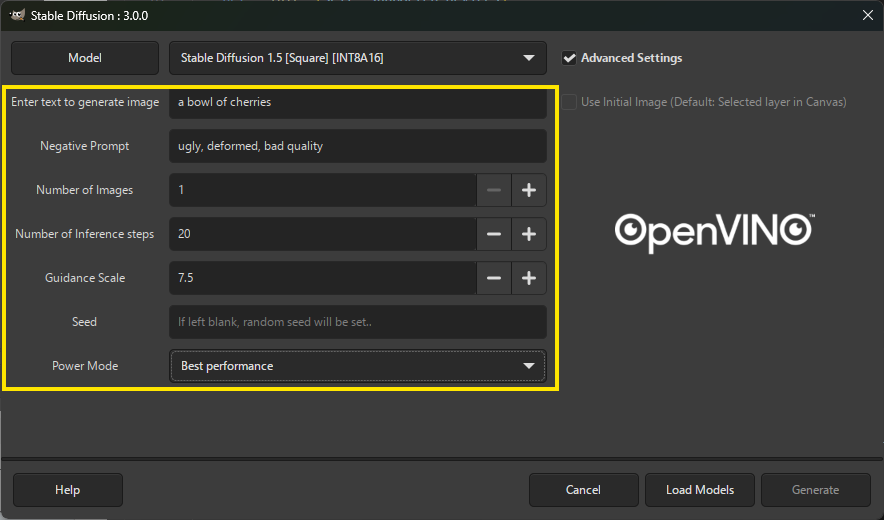

# User guide for Windows Users

## Install GIMP AI plugins with OpenVINO™ Backend on 

>__Notes:__ To get NPU support, please following below configurations. If you are not seeking NPU version, you also can run this pulgin on any Intel CPU and GPU. Please note only Intel's ARC GPU is supported incase you have an external GPU. 

### Pre-requisite for execution on Intel NPU

- Hardware:
  - Intel Core Ultra platform
  - 16GB system memory as minimum requirement
  - internet connection is required for installation
- Driver:
  - Intel NPU driver: Use the most recent driver you have available. 
- Software and Package:
  - git
  - python 3.9-3.12
    - Note: This document will use python 3.9.13 as an example.
  - VC runtime
  - [GIMP 3.0 RC2](https://download.gimp.org/gimp/v3.0/windows/gimp-3.0.0-RC2-setup.exe)
  - [GIMP AI plugins with OpenVINO™ Backend](https://github.com/intel/openvino-ai-plugins-gimp) from Github.


### Install Python

>__Notes:__ Use Python `3.9.13` as an example.

Please download the prebuilt Windows x64 package from [link](https://www.python.org/ftp/python/3.9.13/python-3.9.13-amd64.exe). After downloading, please following below steps to install the Python package.

- Check "Add Python 3.9 to PATH", then click "Install Now"

    
    


- Click "Close"

    


### Install Git

>__Notes:__ Use Git `2.43.0` as an example.

Please download the prebuilt Windows x64 package from [link](https://github.com/git-for-windows/git/releases/download/v2.43.0.windows.1/Git-2.43.0-64-bit.exe). After downloading, please following below steps to install the Git.

- Click "Next", then click "Install"

     

     

     

-  Check out "View Release Notes", then click "Close"

     


### Install Microsoft Visual C++ Redistributable

Please download the latest Visual C++ Redistributable package from MSFT [site](https://aka.ms/vs/17/release/vc_redist.x64.exe). Then, install this package.

 

 

 


### Install GIMP 3.0 RC2

Please download [GIMP 3.0 RC2](https://download.gimp.org/gimp/v3.0/windows/gimp-3.0.0-RC2-setup.exe) and follow below steps to install GIMP.

- Click "Install for all users (recommended)"

    

- Select English and click "OK"

    

- Click "Continue"

    

- Click "Install"

    
    

- Click "Finish" to complete the installation of GIMP

    


### Install GIMP AI plugins 

 - Open command prompt and download the latest release from Github by git with below instruction.

    ```sh
    cd C:\Users\Public\
    mkdir GIMP
    cd GIMP
    git clone https://github.com/intel/openvino-ai-plugins-gimp.git
    ```
    > __Notes__:
    > This is an example that will create a `GIMP` folder in `C:\Users\Public\`, and then download the package to `C:\Users\Public\GIMP`, you still can define where to place this package by yourself.

 - Use same command prompt that used in previous steps and follow the command below to install it.

    ```sh
    openvino-ai-plugins-gimp\install.bat
    ```

    This step will take time for downloading necessary packages.

- After creating python environment, gimpenv3, and downloaded necessary packages, you can now start GIMP application from Start Menu. 

# Execute Stable-Diffusion in GIMP

>Notes: This section runs `SD-1.5 Square (512x512)` as an example. 

With previous section, the GIMP AI plugins with OpenVINO™ Backend is installed and you can execute stable diffusion in GIMP. This session will guide you to execute Stable-Diffusion in GIMP.

## Execute GIMP

You can now simply open Gimp from the start menu as you would any normal Windows application.

## Download & Install Stable Diffusion Models
- Once GIMP application is started, Click "__Layer__" \> "__OpenVINO-AI-Plugins__" \> "__Stable diffusion__".
- Once Stable Diffusion Plugin UI opens up, click on Model Button on the top left corner as show in the below picture:

    
- This now opens the Stable Diffusion Model Management window from where you can install the required models by clicking on "Install" button next to the model name. 

      

 - Download Stable Diffusion 1.5 Square as an instance. 

    
 
 - Once installation process is completed, you will see the "Install" button is updated to "Installed" and you will find the models in the drop-down list

    
    
    >**Notes:**
    > - The downloaded models include INT8, INT8A16, and FP16 precision
    > - Weights is saved at `C:\Users\<user_name>\openvino-ai-plugins-gimp\weights`.


## Execute Stable-Diffusion – Stable Diffusion 1.5 INT8A16

Please follow below steps to execute Stable-Diffusion - Stable Diffusion 1.5 INT8A16. For other features, please refer to [OpenVINO™ Image Generator Plugin with Stable Diffusion](https://github.com/intel/openvino-ai-plugins-gimp/tree/main?tab=readme-ov-file#openvino-image-generator-plugin-with-stable-diffusion) section.

- Following previous section to launch GIMP

    

- Click "__Layer__" \> "__OpenVINO-AI-Plugins__" \> "__Stable diffusion__".

    

- Change the selected fields to set "Stable Diffusion" configuration and choose the desired "Power Mode" you want, then click "Load Models" to the load models into the target devices based on your power mode selection. 

    

    > **Notes:** It takes time in this step. 

- Finally, you can optionally enter any text or changes the parameters in the selected field, then click "Generate" to generate image.

    

    >**Notes:**
    > - Power Mode is now enabled- Users can select between the following options depending on their use case for more detail please check next session:
    >   - Best Performance (Only Intel's ARC GPU supported incase there is an external GPU)
    >   - Best Power Efficiency
    >   - Balanced
    > - If you wish to generate more images in single run, please modify the Number of Images section.

