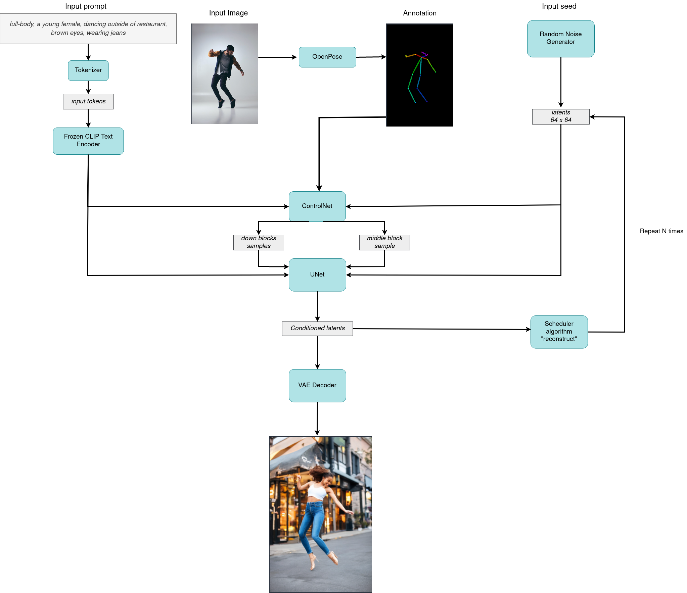
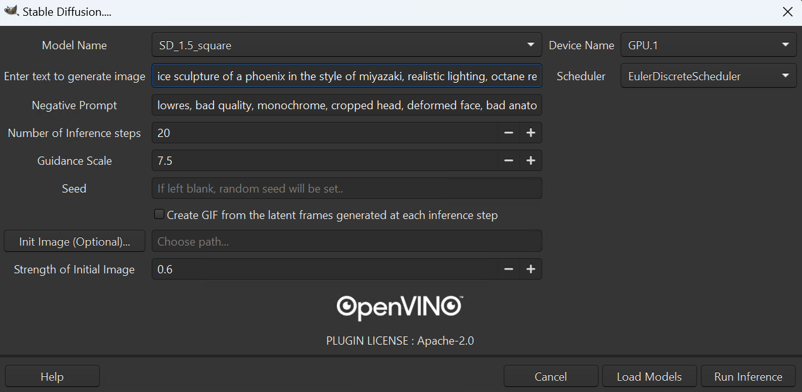
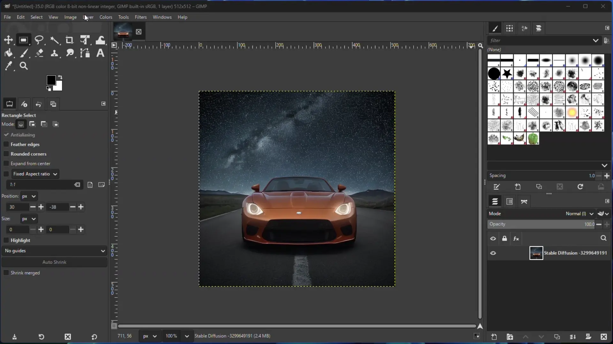
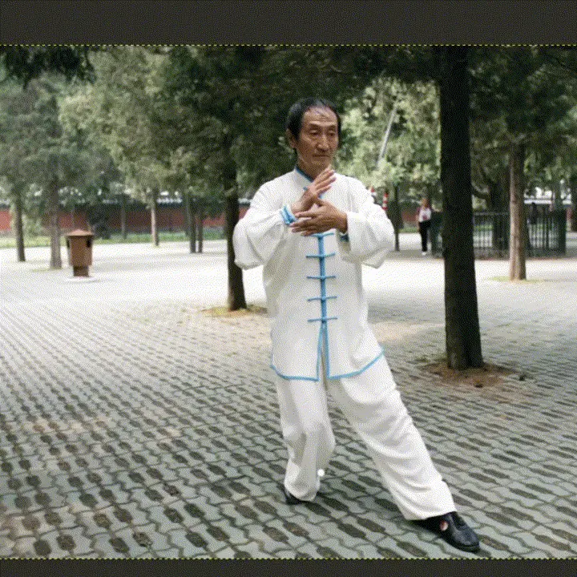

# OpenVINO™ AI Plugins for GIMP

<br>Dedicated for GIMP 3, Python 3 and OpenVINO™.<br> :star: :star: :star: :star: are welcome.<br>

## Current list of plugins:
[1] Super-Resolution <br>
[2] Style-Transfer <br>
[3] Inpainting <br>
[4] Semantic-Segmentation <br>
[5] Stable-Diffusion (Suppports - SD 1.4, SD 1.5 (landscape, portrait, and Latent Consistency Model), SD 1.5 Inpainting, SD 1.5 Controlnet-OpenPose, SD 1.5 Controlnet-CannyEdge, SD 1.5 Controlnet-Scribble) <br>

# Objectives
[1] Provides a set of OpenVINO™ based plugins that add AI features to GIMP. <br>
[2] Serve as a refrence code for how to make use of OpenVino in GIMP application for inferencing on Intel's' CPU & GPU  <br>
[3] Add AI to routine image editing workflows. <br>

# Contribution 
Welcome people interested in contribution !! 
Please raise a PR for any new features, modifactions or bug fixes. 

# Use with GIMP


## Installation Steps

### Install OpenVINO™
- Download and install [OpenVINO™](https://github.com/openvinotoolkit/openvino/releases) for your operating system.
- Note that these plugins have been tested with 2023.1.0 and 2023.2.0
- For Intel&reg; Core™ Ultra support, you need to download and install OpenVINO™ from the archive. Do not use pypi for installation. 


### Windows
Skip steps 1 and 2 if you already have Python3 and Git on Windows

#### 1. Install Python
- Download a Python installer from python.org. Choose Python 3.9 or 3.10 and make sure to pick a 64 bit version. For example, this 3.9.13 installer: https://www.python.org/ftp/python/3.9.13/python-3.9.13-amd64.exe <br>
- Double click on the installer to run it, and follow the steps in the installer. Check the box to add Python to your PATH, and to install py. At the end of the installer, there is an option to disable the PATH length limit. It is recommended to click this. <br>

#### 2. Install Git
- Download and install [GIT](https://git-scm.com/)

#### 3. Install the GIMP Plugin 
1. Install [GIMP 2.99.14](https://download.gimp.org/gimp/v2.99/windows/gimp-2.99.14-setup.exe) <br>
2. Clone this repository: <br>
   ```
   git clone https://github.com/intel/openvino-ai-plugins-gimp.git
   ``` 
3. Setup OpenVINO™ Environment
   <b>Note that you will need to do these steps everytime you start GIMP</b>
   ```
   C:\Path\to\where\you\installed\OpenVINO\setupvars.bat
   ```
4. Run install script - this will create the virtual environment "gimpenv3", install all required packages and will also walk you through models setup. <br>
   ```
   openvino-ai-plugins-gimp\install.bat
   ``` 
   You will be prompted to setup the AI models used with OpenVINO™. Choose the models that you would like to setup, keeping in mind that choosing to download all of them may take time and considerable disk space.
   *You can re-run "run install script" step later again to install & setup models that you may have missed.* <br>
   
3. Start the GIMP application, and add the gimpenv3 path that was printed when running the above step to the list of plugin folders [Edit-> Preferences-> Folders-> Plugins]. <br>
   Example: ```C:\User\<username>\GIMP\gimpenv3\lib\site-packages\gimpopenvino\plugins``` 
   
5. Restart GIMP, and you should see 'OpenVINO-AI-Plugins' show up in 'Layer' menu <br>
   ```
   call "C:\Path\to\where\you\installed\OpenVINO\setupvars.bat"
   cd "C:\Program Files\GIMP 2.99\bin"
   .\gimp-2.99.exe
   ```
   Note that you need to run setupvars.bat everytime you start GIMP. Creating a .bat file to do these steps may be helpful.

### Linux 
This plugin is tested on Ubuntu 22.04. 
Building GIMP from source is recommended.

#### 1. Install Dependencies
   ```
   sudo apt update
   sudo apt install -y cmake libgflags-dev patchelf python3-pip gettext git git-lfs build-essential meson ninja-build autoconf libcairo2-dev libxt-dev libgdk-pixbuf-2.0-dev libgexiv2-dev libgtk-3-dev libmypaint-dev mypaint-brushes libbz2-dev libatk1.0-dev libgirepository1.0-dev libx11-xcb-dev libwmf-dev libxcb-glx0-dev  libxcb-dri2-0-dev   libxxf86vm-dev   valgrind  libappstream-glib-dev  libpugixml-dev libxmu-dev   libpoppler-glib-dev   xsltproc librsvg2-dev libopencv-dev
   ```

#### 2. Clone, build, and install babl 
```
git clone https://gitlab.gnome.org/GNOME/babl
cd babl
git checkout tags/BABL_0_1_98
meson _build
ninja -C _build
sudo ninja -C _build install
```
#### 3. Clone, build, and install gegl
```
git clone https://gitlab.gnome.org/GNOME/gegl
cd gegl
git checkout tags/GEGL_0_4_46
meson _build
ninja -C _build
sudo ninja -C _build install
```

#### 4. Clone, build, and install Gimp
```
git clone https://gitlab.gnome.org/GNOME/gimp
cd gimp
git checkout tags/GIMP_2_99_16
meson _build
ninja -C _build
sudo ninja -C _build install
```
#### 5. Install Plugins
1. Clone this repo
   ```
   git clone https://github.com/intel/openvino-ai-plugins-gimp.git
   ```
2. Setup the environment Note that you will need to do these steps everytime you start GIMP
   ```
   source /opt/intel/openvino/setupvars.sh
   export GI_TYPELIB_PATH=/usr/lib/x86_64-linux-gnu/girepository-1.0:/usr/local/lib/x86_64-linux-gnu/girepository-1.0
   ```
3. Run install script, and download models. The following steps will create the virtual environment "gimpenv3", install all required packages and will also walk you through models setup.
   ```
   chmod +x openvino-ai-plugins-gimp/install.sh
   source /opt/intel/openvino/setupvars.sh
   ./openvino-ai-plugins-gimp/install.sh
   ```
   You will be prompted to setup the AI models used with OpenVINO™. Choose the models that you would like to setup, keeping in mind that choosing to download all of them may take time and considerable disk space.<br>
   *You can re-run "run install script" step later again to install & setup models that you may have missed.* <br>

5. Start the GIMP application (```gimp-2.99```), and add the gimpenv3 path that was printed when running the above step to the list of plugin folders  [Edit-> Preferences-> Folders-> Plugins]. <br>
6. Restart GIMP, and you should see 'OpenVINO-AI-Plugins' show up in 'Layer' menu <br>
   ```
   source /opt/intel/openvino/setupvars.sh
   export GI_TYPELIB_PATH=/usr/lib/x86_64-linux-gnu/girepository-1.0:/usr/local/lib/x86_64-linux-gnu/girepository-1.0
   gimp-2.99
   ```

# OpenVINO™ Image Generator Plugin with Stable Diffusion 
#### A. Prompt to Image 
1. Create or choose a layer  <br>
2. Select Stable Diffusion from the drop down list in layers -> OpenVINO-AI-Plugins <br>
3. Choose the desired model and device from the drop down list.<br>
   - note that the [Latent Consistency Model](https://huggingface.co/SimianLuo/LCM_Dreamshaper_v7) is now supported. Choose `SD_1.5_square_lcm`
4. Click on "Load Models" to compile & load the model on the selected device. Wait for it to complete. Please note that you need to perform this step only if you change the model or device or both. For any subsequent runs just click "Run Inference" <br>
5. Enter prompt and other parameters <br>
6. Click on “Generate”. Wait for the total inference steps to get completed. <br>

#### B. Image to Image
1. Create or choose a layer or open an image  <br>
2. Follow steps 2,3,4,5 from section A. <br> 
3. Select "Use Initial Image"
4. By default the opened image in canvas will be used as initial image to the model. You can also select a different image by browsing from files.
5. Click on “Generate”. Wait for the total inference steps to get completed. <br>

#### C. Stable-Diffusion-1.5 Inpainting - Make sure to download and convert the model during install process. 
1. Choose a layer or Open an image of size 512x512. (Currently works best with this resolution) <br>
2. Use "Free select tool" to select the area in your image that you wish to change. <br>
3. Right click on your image and click on "Add layer mask". Then choose "Selection" in "Initalize layer Mask to". This should create a mask with your selection.
4. Follow steps 2,3,4,5 from section A. Please note that you will only see "SD_1.5_Inpainting" in model options if you added a mask layer to your image. <br>
5. Click on “Generate”. Wait for the total inference steps to get completed. <br>

#### D. Stable-Diffusion-1.5 Controlnet-Openpose - Make sure to download and convert the model during install process. 
1. Open an image with some pose that you want to see in new image. <br>
2. Select Stable Diffusion from the drop down list in layers -> OpenVINO-AI-Plugins <br>
3. Choose the controlnet_openpose model and device from the drop down list.<br>
4. Make sure to select -- "Use Initial Image" option from the GUI. If not selected then it will fail. 
5. Follow steps 4,5 from section A. <br>
6. Click on “Generate”. Wait for the total inference steps to get completed. <br>




#### E. Stable-Diffusion-1.5 Controlnet-CannyEdge - Make sure to download and convert the model during install process. 
1. Open an image that you want to use for generating the new image. <br>
2. Select Stable Diffusion from the drop down list in layers -> OpenVINO-AI-Plugins <br>
3. Choose the controlnet_canny model and device from the drop down list.<br>
4. Make sure to select -- "Use Initial Image" option from the GUI. If not selected then it will fail. 
5. Follow steps 4,5 from section A. <br>
6. Click on “Generate”. Wait for the total inference steps to get completed. <br>


#### F. Stable-Diffusion-1.5 Controlnet-Scribble - Make sure to download and convert the model during install process. 
1. Open an image that you want to use for generating the new image. <br>
2. Select Stable Diffusion from the drop down list in layers -> OpenVINO-AI-Plugins <br>
3. Choose the controlnet_scribble model and device from the drop down list.<br>
4. Make sure to select -- "Use Initial Image" option from the GUI. If not selected then it will fail. 
5. Follow steps 4,5 from section A. <br>
6. Click on “Generate”. Wait for the total inference steps to get completed. <br>

_Note that the screenshots below are based on the previous UI_



### OpenVINO™ Semantic Segmentation Plugin


### OpenVINO™ Super Resolution Plugin 


### OpenVINO™ Style Transfer Plugin


### OpenVINO™ Inpainting Plugin 
1. Open an image in GIMP. <br>
2. Make sure there is alpha channel added to the image by right clicking on the image from layer section and selecting “Add alpha channel” <br>
3. Add a new transparent layer of the same size as original image. <br>
4. Select paint brush with white foreground color and black background color. Choose the thickness of the brush <br>
10. Now paint the object that you want to remove from the image. <br>
11. Select the new layer and image at the same. You should see “two items selected in layer section” <br>





# Acknowledgements
* Plugin architecture inspired from GIMP-ML - https://github.com/kritiksoman/GIMP-ML/tree/GIMP3-ML
* Stable Diffusion Engine - https://github.com/bes-dev/stable_diffusion.openvino


# License
Apache 2.0


# Disclaimer
Stable Diffusion’s data model is governed by the Creative ML Open Rail M license, which is not an open source license.
https://github.com/CompVis/stable-diffusion. Users are responsible for their own assessment whether their proposed use of the project code and model would be governed by and permissible under this license.

