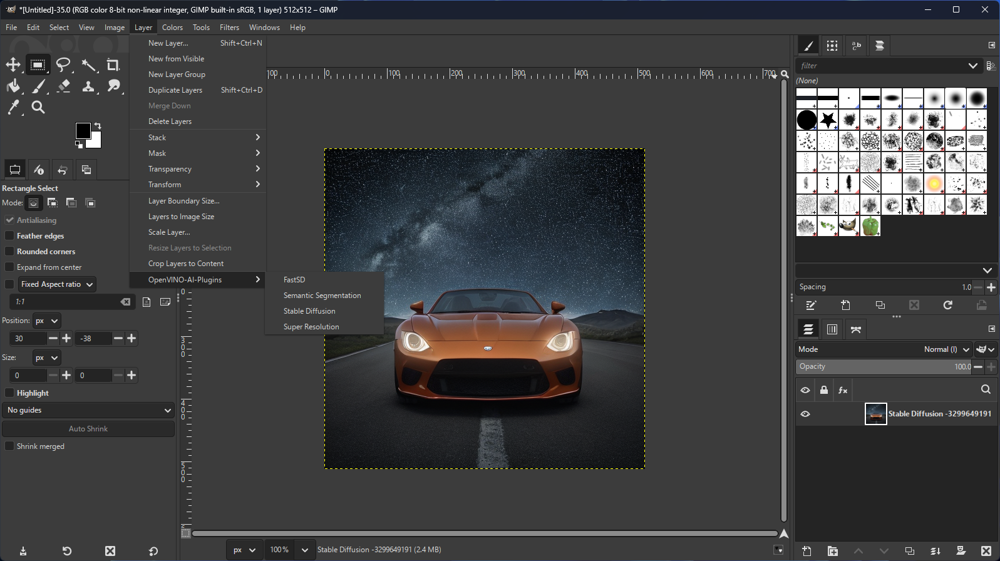

# OpenVINO™ AI Plugins for GIMP

This branch is under development. <br>Dedicated for GIMP 3, Python 3 and OpenVino.<br> :star: :star: :star: :star: are welcome.<br>

## Current list of plugins:
[1] Super-Resolution <br>
[2] Style-Transfer <br>
[3] Inpainting <br>
[4] Semantic-Segmentation <br>
[5] Stable-Diffusion <br>

# Objectives
[1] Provides a set of OpenVino based plugins that add AI features to GIMP. <br>
[2] Serve as a refrence code for how to make use of OpenVino in GIMP application for inferencing on Intel's' CPU & GPU  <br>
[3] Add AI to routine image editing workflows. <br>

# Contribution 
Welcome people interested in contribution !! 
Please raise a PR for any new features, modifactions or bug fixes. 


# Use as a Python Package
```Python
import cv2
import gimpopenvino
```

# Use with GIMP


## Installation Steps
[1] Install [GIMP](https://www.gimp.org/downloads/devel/) 2.99.10 (revision 2)  (Only windows and linux) <br>
[2] Install OpenVino Runtime 2022.3 https://www.intel.com/content/www/us/en/developer/tools/openvino-toolkit/download.html . <br>
[3] Clone this repository: git clone https://github.com/intel/openvino-ai-plugins-gimp.git <br>
[4] windows install: <br>
```openvino-ai-plugins-gimp\install.bat```<br>
[5] Follow steps that are printed in terminal or cmd to add the gimpenv3 path to the GIMP GUI [Edit-> Preferences-> Folders-> Plugins]. <br>
[6] Copy the weights folder to ```C:\Users\<user_name>\openvino-ai-plugins-gimp\weights``` <br>
[7] Download Stable-Diffusion models from https://huggingface.co/bes-dev/stable-diffusion-v1-4-openvino/tree/main and place it in ```C:\Users\<user_name>\openvino-ai-plugins-gimp\weights\stable-diffusion-ov```

## Running GIMP
[1] In a new command window run setupvars.bat from OpenVino toolkit folder. <br>
[2] Navigate to the GIMP installation directory: <br>
```cd C:\Program Files\GIMP 2.99\bin```
[3] Start the GIMP application: <br>
```gimp-2.99.exe``` <br>
[4] GIMP GUI should start up. Check if the OpenVino Plugins are loaded by going to layers -> OpenVino-AI-Plugins. <br>

### OpenVINO™ Semantic Segmentation Plugin


### OpenVINO™ Super Resolution Plugin 


# Acknowledgements
* Plugin architecture inspired from GIMP-ML - https://github.com/kritiksoman/GIMP-ML/tree/GIMP3-ML
* Stable Diffusion Engine - https://github.com/bes-dev/stable_diffusion.openvino


# License
Apache 2.0


# Disclaimer
Stable Diffusion’s data model is governed by the Creative ML Open Rail M license, which is not an open source license.
https://github.com/CompVis/stable-diffusion. Users are responsible for their own assessment whether their proposed use of the project code and model would be governed by and permissible under this license.

