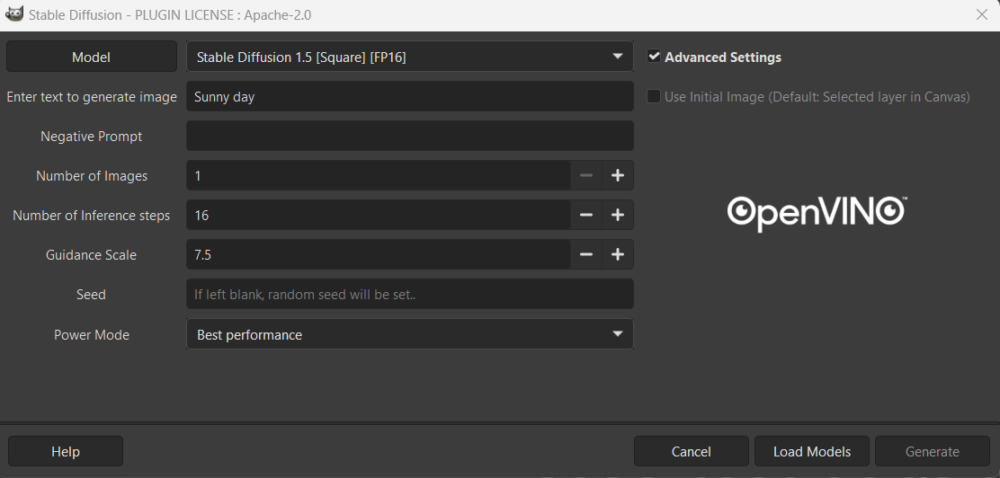
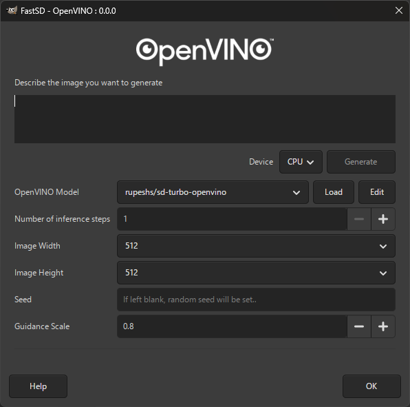

# OpenVINO™ AI Plugins for GIMP 

 Dedicated for GIMP 3, Python 3 and OpenVINO™.  :star: :star: :star: :star: are welcome. 

## Current list of plugins:
1. Super-Resolution 
2. Semantic-Segmentation 
3. Stable-Diffusion  
    * SD 1.5
    * SD 1.5 LCM
    * SD 1.5 Inpainting 
    * SD 1.5 Controlnet-OpenPose 
    * SD 1.5 Controlnet-CannyEdge 
    * SD 1.5 Controlnet-Scribble 
    * SDXL (Turbo, Base)
    * SDXL Inpainting 
    * SD 3.0 Medium
    * SD 3.5 Medium Turbo
    
4. [FastSD](https://github.com/rupeshs/fastsdcpu) 
    * rupeshs/sd-turbo-openvino
    * rupeshs/sdxs-512-0.9-openvino
    * rupeshs/SDXL-Lightning-2steps-openvino-int8
    * rupeshs/sdxl-turbo-openvino-int8
    * rupeshs/LCM-dreamshaper-v7-openvino
    * rupeshs/sd15-lcm-square-openvino-int8
    * OpenVINO/FLUX.1-schnell-int4-ov
    * rupeshs/sana-sprint-0.6b-openvino-int4
    

# Objectives
1. Provides a set of OpenVINO™ based plugins that add AI features to GIMP. 
2. Serve as a reference code for how to make use of OpenVino in GIMP application for inferencing on Intel® Devices. 
3. Add AI to routine image editing workflows. 

# Contribution
Welcome people interested in contribution!
Please raise a PR for any new features, modifications, or bug fixes.

# Use with GIMP

## Installation Steps
### Windows
For detailed steps and tips please refer [User guide for Windows](./Docs/user_guide_for_windows_users.md).

### Linux
This plugin is tested on Ubuntu 24.04. Building GIMP from source is recommended. Flatpak is not supported. 
For detailed steps and tips please refer to [Linux Installation Guide](./Docs/linux_install_guide.md).

# OpenVINO™ Image Generator Plugin with Stable Diffusion
#### Power Mode is enabled for int8 SD models and systems that has a "NPU" only 
#### A. Prompt to Image
1. You can start with a blank canvas or create/choose a layer
2. Select Stable Diffusion from the drop down list in layers -> OpenVINO-AI-Plugins
3. Choose the desired Model and Power Mode from the drop down list.
4. Click on "Load Models" to compile & load the model on the device. Wait for it to complete. Please note that you need to perform this step only if you change the model or device or both. For any subsequent runs just click "Run Inference"
5. Enter prompt and other parameters
6. Click on “Generate”. Wait for the total inference steps to get completed.

#### B. Image to Image
1. Create or choose a layer or open an image
2. Follow steps 2,3,4,5 from section A.
3. Select "Use Initial Image"
4. By default the opened image in canvas will be used as initial image to the model. You can also select a different image by browsing from files.
5. Click on “Generate”. Wait for the total inference steps to get completed.

#### C. Stable-Diffusion-1.5 Inpainting - Make sure to download and convert the model during install process.
1. Choose a layer or Open an image of size 512x512. (Currently works best with this resolution)
2. Use "Free select tool" to select the area in your image that you wish to change.
3. Right click on your image and click on "Add layer mask". Then choose "Selection" in "Initialize layer Mask to". This should create a mask with your selection.
4. Follow steps 2,3,4,5 from section A. Please note that you will only see "sd_1.5_Inpainting" in model options if you added a mask layer to your image.
5. Click on “Generate”. Wait for the total inference steps to get completed.

#### D. Stable-Diffusion-1.5 Controlnet-Openpose - Make sure to download and convert the model during install process.
1. Open an image with some pose that you want to see in new image.
2. Select Stable Diffusion from the drop down list in layers -> OpenVINO-AI-Plugins
3. Choose the controlnet_openpose model and device from the drop down list.
4. Make sure to select -- "Use Initial Image" option from the GUI. If not selected then it will fail.
5. Follow steps 4,5 from section A.
6. Click on “Generate”. Wait for the total inference steps to get completed.

#### E. Stable-Diffusion-1.5 Controlnet-CannyEdge - Make sure to download and convert the model during install process.
1. Open an image that you want to use for generating the new image.
2. Select Stable Diffusion from the drop down list in layers -> OpenVINO-AI-Plugins
3. Choose the controlnet_canny model and device from the drop down list.
4. Make sure to select -- "Use Initial Image" option from the GUI. If not selected then it will fail.
5. Follow steps 4,5 from section A.
6. Click on “Generate”. Wait for the total inference steps to get completed.

#### F. Stable-Diffusion-1.5 Controlnet-Scribble - Make sure to download and convert the model during install process.
1. Open an image that you want to use for generating the new image.
2. Select Stable Diffusion from the drop down list in layers -> OpenVINO-AI-Plugins
3. Choose the controlnet_scribble model and device from the drop down list.
4. Make sure to select -- "Use Initial Image" option from the GUI. If not selected then it will fail.
5. Follow steps 4,5 from section A.
6. Click on “Generate”. Wait for the total inference steps to get completed.

#### G. Stable-Diffusion-3.0 Medium & Stable-Diffusion-3.5 Medium Turbo
Please see [Stable Diffusion 3 User Guilde](./Docs/stable-diffusion-v3.md) for details
_With Advanced Setting and Power Mode_
For SD3.5 Medium Turbo - Select Guidance Scale between 0.0 - 1.0, as anything greater than 1.0 will result in a failure. Also, with the Turbo version one can generate valid images in as few as 4 iterations. 
⚠️ **Disclaimer**  
The very first time you do "Load Models", it may take a few minutes. Subsequent runs will be much faster once the model is cached.

#### H. SDXL 
For SDXL Turbo - Please make sure to Select Guidance Scale between 0.0 - 1.0. Also, for number of inference steps use between 2-5 for best result. 
⚠️ **Disclaimer**  
The very first time you do "Load Models", it may take a few minutes. Subsequent runs will be much faster once the model is cached.

### OpenVINO™ Semantic Segmentation Plugin

### OpenVINO™ Super Resolution Plugin

### FastSD Plugin

FastSD is a faster version of stable diffusion based on Latent Consistency Models and Adversarial Diffusion Distillation. It Supports CPU/GPU/NPU faster inference using OpenVINO.
- FastSD models can be edited by using the FastSD Model Manager
- FLUX.1-schnell (3 to 4 steps),SANA sprint model (2 steps) support
- Models are downloaded at runtime, the first time the model is used. 

Note: For NPU usage please use the `rupeshs/sd15-lcm-square-openvino-int8` model.

# Acknowledgements
* Plugin architecture inspired from GIMP-ML - https://github.com/kritiksoman/GIMP-ML/tree/GIMP3-ML
* Stable Diffusion Engine - https://github.com/bes-dev/stable_diffusion.openvino

# License
Apache 2.0

# Disclaimer
Stable Diffusion’s data model is governed by the Creative ML Open Rail M license, which is not an open source license.
https://github.com/CompVis/stable-diffusion. Users are responsible for their own assessment whether their proposed use of the project code and model would be governed by and permissible under this license.
