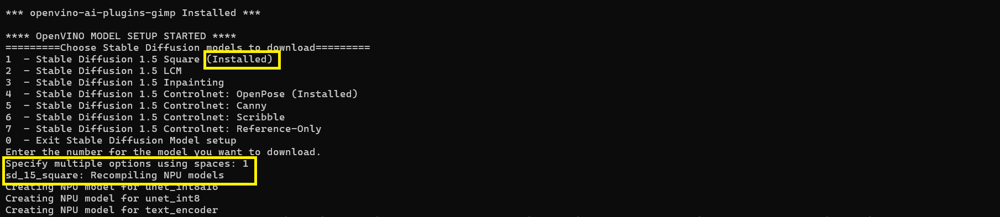

# Running Stable Diffusion without Installing GIMP
 
For these instructions, we assume that you have cloned this repo inside `%userprofile%\GIMP` directory and that the virtual environment for GIMP is in `%userprofile%\GIMP\gimpenv3`.
## Install and Model Setup

The following commands can be run in a new command window.
1. Navigate to  %userprofile%\GIMP
  ```
  cd  %userprofile%\GIMP
  ```
  
2. Run install.bat from %userprofile%\GIMP directory.  

```
openvino-ai-plugins-gimp\install.bat --install_models
```
3. As install.bat completes, you will be asked to download the models with a few prompts. There are now two options: 

    Download the models for the first time, follow 3a. 

    Recompile already downloaded models, follow 3b. 
    
    3a.  Downloading for the first time <br/>
    Download "1", Stable Diffusion 1.5 Square as an instance.  <br/>

     

    3b. Already installed but needs recompiling.  <br/>
    If you have already downloaded the models, it will show as Installed. If you need to recompile just choose it again <br/>

     

4. Activate the environment. 
  ```
  gimpenv3\Scripts\activate 
  ```
## Running the Stable Diffusion Commandline

These commands should be run in the same window where you have activated the environment. <br>
### Basic Options
Run the python stable diffusion engine with the -h option to see the possible options.
```
python openvino-ai-plugins-gimp\testscases\StableDiffusion\stable_diffusion_engine_tc.py -h
``` 
You should see the following output:


### Example 1: Defaults 
Default options for INT8 on NPU
```
python openvino-ai-plugins-gimp\testscases\StableDiffusion\stable_diffusion_engine_tc.py -m sd_1.5_square_int8 -pm "best power efficiency"
```


In the output above, you should see the iterations per second. This is an instantaenous measurement, and not an average. It gives you a general idea of the speed of Unet, but the more important number is the Image generation time (red arrow at the bottom).
 
### Example 2: Overriding the devlces
Command line options allow you to over ride the devices in config.json without having to modify the config. For example, moving the VAE to GPU in the power efficiency mode:
```
python openvino-ai-plugins-gimp\testscases\StableDiffusion\stable_diffusion_engine_tc.py -m sd_1.5_square_int8 -pm "best power efficiency" -vd GPU
```


### Example 3: Generating multiple images.
In general, the first inference is slower. The recommendation is to generate multiple images in a row. The script will output the average image generation time.
```
python openvino-ai-plugins-gimp\testscases\StableDiffusion\stable_diffusion_engine_tc.py -m sd_1.5_square_int8 -pm "best power efficiency" -vd GPU -n 5
```


### Example 4: Saving images to check accuracy
Use the -si option to save images in the directory that the script is run from. 
```
python openvino-ai-plugins-gimp\testscases\StableDiffusion\stable_diffusion_engine_tc.py -m sd_1.5_square_int8 -pm "best power efficiency" -vd GPU -n 5 -si
```


